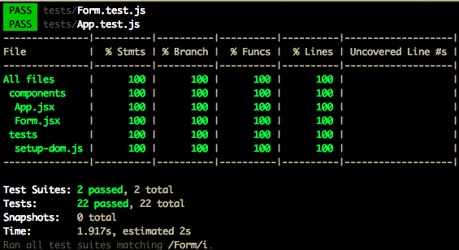

# Form validation problem

Hi and yes, I've stumbled across this challenge.

## To see my solution locally

```
git clone https://github.com/annika-philipp/form-validation-problem
cd form-validation-problem
yarn 
yarn dev
```

Then go to [http://localhost:3000](http://localhost:3000) and see the form.


## The cherry on the cake

* I have documented my code both within the Form component (to explain the logic behind each function) but have also fully tested this app. Well written tests add to my documentation and I've added an additional comment for the email test scenario. 

* I used git/Github and created meaninfully named branches to keep working on different parts of this app separate
* I names my commit messages in a meaningful way
* I added responsiveness to this app to make it mobile friendly


## Tests

I've used enzyme and jest for my tests and you can run them in your cli like so,

```
yarn test
```


